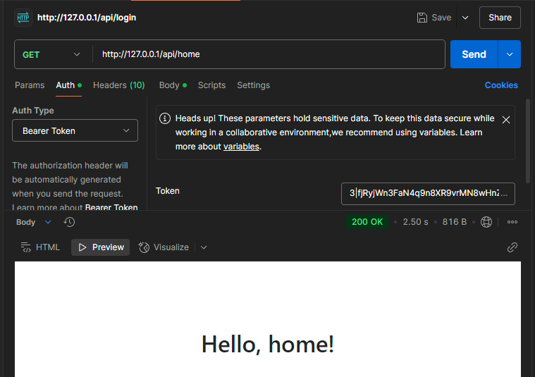

<p align="center"><a href="https://laravel.com" target="_blank"></a></p>

<p align="center">
<a href="https://github.com/laravel/framework/actions"></a>
<a href="https://packagist.org/packages/laravel/framework"></a>
<a href="https://packagist.org/packages/laravel/framework"></a>
<a href="https://packagist.org/packages/laravel/framework"></a>
</p>

## Running API

- Clone repository
- ```cd laravel-stanctum-api```
- ```cp .env.example .env```
- ```docker-compose up -d```
- ```docker-compose exec app composer install```
- ```docker-compose exec app php artisan key:generate```
- ```docker-compose exec app php artisan migrate:fresh --seed```

## Api end-points

### Login:

```
curl --location 'http://127.0.0.1/api/login' \
--form 'email="test.user@example.com"' \
--form 'password="password123"'
```


### Logout

```
curl --location --request POST 'http://127.0.0.1/api/logout' \
--header 'Authorization: Bearer 2|HFAtkxgQeQmCHZPhsL4CGShUSsvJ8XGActVv55ip82cae5d1'
```


### Home

```
curl --location 'http://127.0.0.1/api/home' \
--header 'Authorization: Bearer 3|XF78VVtQUSLa2sFlKKsM9tWzG445CAUFwwc0Jccq0af87df8'
```


